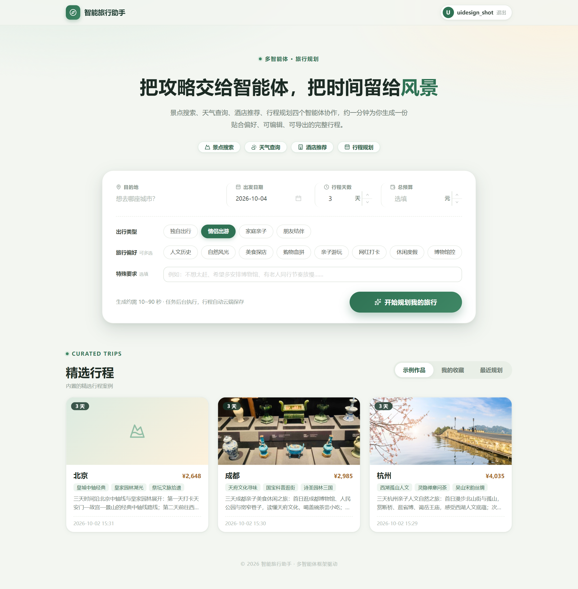
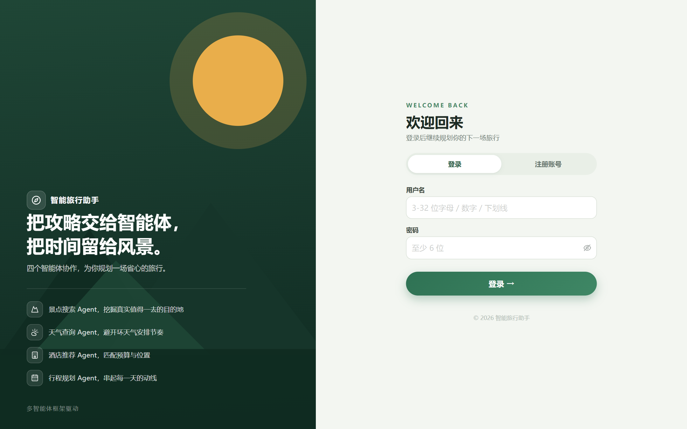
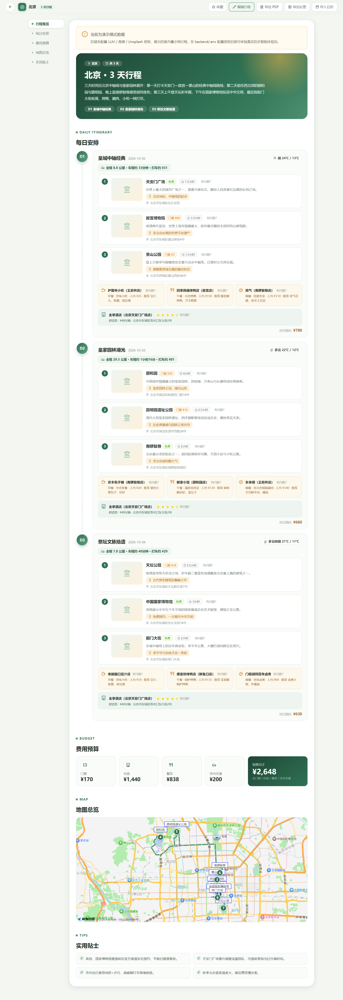

# 🧭 智能旅行助手

[](https://github.com/xiaoqingxu271/smart-trip-planner/actions/workflows/ci.yml)

基于 [Hello-Agents 第十三章 · 智能旅行助手](https://datawhalechina.github.io/hello-agents/#/./chapter13/%E7%AC%AC%E5%8D%81%E4%B8%89%E7%AB%A0%20%E6%99%BA%E8%83%BD%E6%97%85%E8%A1%8C%E5%8A%A9%E6%89%8B) 的设计与 [HelloAgents](https://github.com/datawhalechina/hello-agents) 框架实现的完整旅行规划应用：四个专用智能体协作，通过 **MCP 协议**调用高德地图真实数据，生成含景点、三餐、酒店、天气、预算的完整行程，支持地图可视化、行程编辑与导出。

## 🖼 界面预览

| 首页（规划搜索卡 + 精选行程画廊） | 登录页（分屏品牌视觉） | 行程结果（时间线 + 地图） |
|---|---|---|
|  |  |  |

> 界面采用"森林绿 + 奶油底 + 琥珀点缀"的旅行编辑风设计系统（灵感参考 Dribbble 旅行类高赞作品），图标使用 Lucide 线性图标库（ISC 许可），全局设计令牌见 `frontend/src/style.css`。

## ✨ 五大核心功能

| 功能 | 说明 |
|---|---|
| 🤖 智能行程规划 | 输入目的地/日期/偏好，4 个 Agent 自动生成完整计划；**异步任务 + 真实进度轮询，中途关闭页面行程不丢** |
| 🗺 地图可视化 | 高德地图标注全部景点、按天编号，**每日真实驾车路线**（折线 + 里程 + 车程 + 打车费） |
| 💰 预算计算 | 门票 / 住宿 / 餐饮 / 交通分项与总计（市内交通参考高德 `taxi_cost` 实价） |
| ✏️ 行程编辑 | 添加（自动地理编码）、删除、上下调整景点，实时同步 |
| 📄 导出 | 一键导出 PDF（A4 多页）、长图、**iCal 日历**（行程直接进手机日历） |

## 🏗 系统架构

```
前端层 Vue3 + TS + Ant Design Vue          后端层 FastAPI            智能体层 HelloAgents                外部服务层
┌──────────────────────────┐   HTTP   ┌───────────────────┐      ┌────────────────────────┐   MCP   ┌───────────────┐
│ Home.vue  表单/加载进度   │ ───────→ │ /api/trip/plan    │ ───→ │ ① AttractionSearchAgent│ ──────→ │ 高德 MCP 服务器 │
│ Result.vue 地图/编辑/导出 │ ←─────── │ /api/utils/geocode│      │ ② WeatherQueryAgent    │ (stdio) │ 12 个地图工具   │
│                           │          │ /api/config       │      │ ③ HotelAgent           │         ├───────────────┤
└──────────────────────────┘          └───────────────────┘      │ ④ PlannerAgent(纯规划) │ ──────→ │ LLM API       │
                                            ↓ 图片增强             └────────────────────────┘         ├───────────────┤
                                      UnsplashService（非工具）         共享同一个 MCPTool 实例          │ Unsplash API  │
                                                                                                        └───────────────┘
```

多 Agent 协作流程（五步）：**景点搜索 → 天气查询 → 酒店推荐 → 拼接上下文交给 Planner → 解析 JSON 生成 TripPlan**。
三个搜索型 Agent 共享同一个 MCP 服务器进程（只启动一次，节省资源）；Planner 不调用任何工具，专职整合输出严格 JSON。

## 📁 项目结构

```
smart-trip-planner/
├── backend/
│   ├── requirements.txt / requirements-dev.txt
│   ├── .env.example                 # 复制为 .env 并填入密钥
│   ├── sql/init.sql                 # 建表脚本（应用启动时自动执行，可重复执行）
│   └── app/
│       ├── config.py                # 环境变量配置
│       ├── models/schemas.py        # Pydantic 数据模型（Location→…→TripPlan）
│       ├── agents/
│       │   ├── mcp_tool.py          # MCPTool：MCP stdio 客户端 + auto_expand 展开
│       │   ├── prompts.py           # 4 个 Agent 的提示词
│       │   ├── validator.py         # 规划后确定性校验（真实性/闭馆/动线/密度）
│       │   └── trip_planner.py      # TripPlannerAgent 多 Agent 流水线
│       ├── services/                # 图片服务 / 演示数据 / 限流等
│       ├── storage/                 # MySQL(db/trip_store) + Redis(cache) 协作层
│       └── api/main.py              # FastAPI 路由 + 鉴权/限流中间件
├── frontend/
│   └── src/
│       ├── App.vue                  # antd 全局主题令牌（森林绿设计系统）
│       ├── style.css                # CSS 设计令牌（配色/圆角/阴影/眉标）
│       ├── router/index.ts          # 登录守卫（按后端鉴权形态选择凭证）
│       ├── components/AppIcon.vue   # Lucide 图标统一渲染组件
│       ├── assets/icons/            # 本地化的 Lucide SVG（ISC 许可）
│       ├── views/Home.vue           # Hero + 分栏规划搜索卡 + 精选行程画廊
│       ├── views/Login.vue          # 分屏登录/注册（多用户模式）
│       ├── views/Result.vue         # 概览横幅/时间线/Bento 预算/地图/导出
│       ├── services/api.ts          # Axios 封装（2 分钟超时）
│       └── types/index.ts           # 与后端 schemas 一一对应的 TS 类型
├── docs/screenshots/                # README 界面截图
└── .github/workflows/ci.yml         # CI：后端 pytest（MySQL/Redis 服务）+ 前端构建测试
```

## 🚀 快速开始

### 0. 准备密钥（可选）

| 密钥 | 用途 | 获取方式 |
|---|---|---|
| `LLM_API_KEY` | 智能体大脑（OpenAI 兼容均可：DeepSeek / OpenAI / 智谱…） | [DeepSeek 开放平台](https://platform.deepseek.com/) 等 |
| `AMAP_API_KEY` | MCP 服务器调用高德数据（**Web 服务**类型 Key） | [高德开放平台](https://console.amap.com/) → 应用管理 → 添加 Key → 服务平台选「Web 服务」 |
| `AMAP_JS_KEY` | 前端地图展示（**Web 端(JS API)** 类型 Key，2021-12 后申请的还需配套安全密钥 `AMAP_JS_SECRET`） | 同上，服务平台选「Web 端 (JS API)」 |
| `UNSPLASH_ACCESS_KEY` | 景点配图（可选） | [Unsplash Developers](https://unsplash.com/developers) |

> 💡 **不配置任何密钥也能跑**：后端检测到缺少 `LLM_API_KEY` / `AMAP_API_KEY` 时自动进入演示模式，返回内置的北京 3 日示例行程，可完整体验前端全部功能（地图展示除外）。

### 1. 启动后端（Python 3.10+）

```bash
cd backend
pip install -r requirements.txt
copy .env.example .env        # 填入你的密钥；Linux/Mac 用 cp
uvicorn app.api.main:app --reload --port 8000
```

启动后访问 <http://localhost:8000/docs> 可查看交互式 API 文档。

### 2. 启动前端（Node 18+）

```bash
cd frontend
npm install
npm run dev
```

打开 <http://localhost:5173> 即可使用。Vite 已配置 `/api` 代理到后端 8000 端口，无跨域问题。

> 💡 鉴权形态由 `.env` 决定：默认 `AUTH_MODE=none` 无需登录；配置 `AUTH_MODE=user` 后开放注册/登录（首次使用在登录页注册账号即可），行程按用户隔离；配置 `APP_PASSWORD` 则为单访问码模式。

Windows 用户也可直接双击 `start_backend.bat` 与 `start_frontend.bat`。

### Docker 一键部署

```bash
# 前提：backend/.env 已配置密钥；MySQL/Redis 由容器提供
docker compose up -d --build
# 前端访问 http://localhost:8080，后端 API 在 http://localhost:8000
```

### 测试

```bash
cd backend  && pip install -r requirements-dev.txt && python -m pytest tests/ -v
cd frontend && npm test
```

## 🗄 存储架构：MySQL + Redis 协作

原则：**MySQL 是唯一事实来源，Redis 只做加速与协调**，清空 Redis 功能不受损。

| 层 | 职责 |
|---|---|
| MySQL（`trip_planner.trips`） | 行程持久化：每次规划成功自动入库（请求 + 完整计划 JSON + 预算），支持收藏/删除；`sql/init.sql` 可重复执行 |
| Redis | ① `trip:detail:{id}` 详情缓存（TTL 24h，写后失效）② `poi:photo:{md5}` POI 图片地址缓存（TTL 7 天，省高德配额）③ `gallery:stars` ZSET 收藏排行 ④ `plan:lock:{md5}` 规划锁（防同一请求并行跑两遍流水线） |

读写路径：详情先查 Redis → 未命中查 MySQL 并回填；写入先落 MySQL 再失效缓存。**全部静默降级**：Redis 不可用→缓存退化为进程内存；MySQL 不可用→规划照常，历史/作品集提示暂不可用（`/api/health` 可查看双库状态）。

> 本地 Redis 为 5.x 时，客户端已强制 RESP2 协议兼容（redis-py 8 默认的 RESP3 握手在 <6.0 服务端会报 `unknown command HELLO`）。

**作品集/历史**：首页下方"精选行程"区含 示例作品（内置种子数据）／我的收藏／最近规划 三个页签，卡片点击进入 `/result?id=` 由服务端按 ID 加载；结果页可一键收藏。

## 🔍 关键实现说明

- **MCPTool**（`backend/app/agents/mcp_tool.py`）：hello-agents 1.0.0 未内置 MCPTool，本项目按书中 `auto_expand` 语义自行实现——以子进程启动官方 `@amap/amap-maps-mcp-server`，通过 stdin/stdout 收发 JSON-RPC（initialize → tools/list → tools/call），并把 MCP 工具自动展开为框架原生 Tool（走 function calling）。三个搜索型 Agent 各持有一个**带工具白名单**的 MCPTool 视图（最小权限：景点 3 个工具、天气 1 个、酒店 1 个），共享同一个 MCP 服务器子进程；白名单在展开过滤与父工具入口两处强制。
- **数据模型**（`backend/app/models/schemas.py`）：自底向上 `Location → Attraction/Meal/Hotel → Weather/Budget → DayPlan → TripPlan`，含高德温度字段 `"16°C" → 16` 的容错验证器；前端 `types/index.ts` 与之一一对应。
- **图片管线**（`backend/app/services/image_service.py`）：三层策略——① 高德 POI 搜索自带的实景照片（`place/text` 返回的 `photos` 字段，与 POI 一一对应，主方案）；② Unsplash 氛围图兜底（需配置 Key）；③ 前端渐变占位图保底。按书中设计这是数据增强而非智能决策，不封装为 Tool，由 API 层在 PlannerAgent 输出后调用。注意高德个人 Key 有 QPS 限制，必须**限速串行 + 限流退避重试**（0.4s 间隔，实测并发会触发 `CUQPS_HAS_EXCEEDED_THE_LIMIT` 限流），并带进程内缓存去重。
- **图片代理**（`GET /api/utils/image?u=`）：POI 图片经后端同源代理转发（白名单域名 + 逐跳重定向复查 + 魔数识别真实类型 + 磁盘缓存 `.image_cache/`），绕开高德 CDN 的防盗链/混合内容/偶发加载失败问题，html2canvas 导出也不再受跨域污染；未知图床域名直接 400（不做开放重定向）。
- **规划后校验 + 带约束重规划**（`backend/app/agents/validator.py` + `POST /api/trip/replan`）：
  - **Validator**（确定性规则，不耗 LLM）：① 真实性——景点在高德核实不到仅弱提醒；核实到但坐标与实际位置偏差 >1.5km 疑似编造（强，触发修复，haversine 纯计算零配额）；② 闭馆日——逐景点查高德 POI 详情的 `open_time/opentime2`，按**每一天自己的日期**判断星期冲突（兼容"周一闭馆/周一全天关闭/星期一不开放"等文案；"除…外逢周一关闭"这类仅部分院落关闭的文案降级为弱提醒）；③ 动线——同日相邻景点驾车距离 >15km（`maps_distance`，结果缓存 7 天）；④ 密度——单日景点 >3。强问题自动带真实替代候选（`maps_around_search` 周边 3km 同类 POI）发回 PlannerAgent 定向修复一次，遗留问题写入 `TripPlan.warnings` 前端展示。
  - **反馈重规划**：结果页每个景点/餐厅/酒店卡片可标记"预约满了/没房了/排队太久/不想去"，提交后系统搜索周边真实替代候选 → PlannerAgent 做最小改动 → 生成新版本（`parent_id` 版本链，可回看上一版）。实时房态/预约余量需企业级 OTA 接口，个人 Key 拿不到，故采用"用户反馈 → 约束重规划"的流程方案。
  - **局部重规划**：自动检测反馈影响的日期（酒店反馈影响全部天），LLM 只重写受影响的天，后端确定性合并回原计划——未受影响的天逐字保留，更快也不会误伤满意的安排。
  - **Plan B 备选景点**：PlannerAgent 每天额外给出 1 个位置顺路的备选（`backup_attractions`），展示在每日卡片中；每个景点旁"☘ 换备选"一键对调（`POST /api/trip/history/{id}/swap-backup`，可逆，换下景点进入备选位可随时换回）。
- **JSON 解析容错**：Planner 输出剥离 ```json 围栏后解析，Pydantic 校验失败会带错误信息自动重试一次。
- **行程编辑**：进入编辑态先 `JSON.parse(JSON.stringify(plan))` 深拷贝草稿，上移/下移用解构交换，取消编辑直接丢弃草稿即可还原。
- **导出**：`html2canvas(scale:2, useCORS:true)` + `jsPDF` A4 多页切割；导出时隐藏地图（地图 Canvas 与 html2canvas 存在兼容性问题，与书中处理一致）。

## 🧪 测试

```bash
cd backend  && pip install -r requirements-dev.txt && python -m pytest tests/ -v
cd frontend && npm test          # vitest：api 服务层单测
cd frontend && npm run build     # vue-tsc 类型检查 + vite 构建
```

后端回归套件（43 个用例）覆盖：请求模型边界（超长输入拦截）、校验器真实性/闭馆/距离规则（FakeClient，不打真实 API）、MCP 工具白名单（展开过滤 + 父入口拦截）、访问码/多用户鉴权、限流中间件（真实 Redis）、规划锁与存储语义。需要真实 Redis 的用例在 Redis 不可用时自动跳过。

## 🤖 CI

GitHub Actions（`.github/workflows/ci.yml`）在每次 push / PR 时运行两个并行任务：

| 任务 | 内容 |
|---|---|
| **后端** | 拉起 MySQL 8.4 + Redis 7 服务容器（健康检查通过才执行），注入连接环境变量，跑全量 pytest（存储/限流/鉴权用例**无 skip 全量执行**） |
| **前端** | `npm ci` → `vue-tsc` 类型检查 + `vite build` → `vitest` 单元测试 |

## 🔒 部署与安全

| 项 | 说明 |
|---|---|
| **单进程约束** | **必须单进程部署**（`uvicorn ... --workers 1`，默认即是）：代码存在单进程假设——MySQL 单连接（连接级互斥）、单个 MCP 服务器子进程、进程内图片缓存、规划并发闸门，多 worker 会破坏正确性 |
| **监听地址** | `python -m app.api.main` 默认只监听 `127.0.0.1`；对外服务改监听地址时**务必配置 `APP_PASSWORD`** |
| 访问码鉴权 | `APP_PASSWORD` 留空=关闭（本地演示行为不变）；配置后所有 `/api/*` 需带访问码（前端出登录页），401 同样计入限流配额，天然抑制暴力枚举 |
| 多用户体系 | `AUTH_MODE=user` 启用：开放注册/登录（PBKDF2 密码 + Redis 会话 Token 7 天），行程按用户隔离；**示例作品与无主历史行程全员可读、仅本人可改删**；注册/登录限流 10 次/分/IP；此模式下忽略 `APP_PASSWORD`。`none`（默认）行为与从前一致 |
| 限流 | 每 IP 固定窗口计数（Redis，fail-open），plan/replan 默认 5 次/5 分钟；`RATE_LIMIT_*` 可调，`RATE_LIMIT_ENABLED=false` 整体关闭（压测用） |
| 宕机保护 | Redis/MySQL 探测失败进入 10s 熔断静默期 + 全链路降级，存储故障不会拖死全站 |
| 高德 QPS | 进程级全局节拍器（`amap_pacer`）统一约束 MCP 调用、校验器与图片服务的调用间隔 |
| 高德 JS Key | 前端地图 Key 与安全密钥本身公开，**务必在高德控制台配置域名白名单**防盗刷 |

## ⚠️ 已知注意事项

1. **首次调用较慢**：`npx` 首次需下载 MCP 服务器包；真实模式下 4 个 Agent 串行执行，全程约 30~90 秒（前端超时已设为 2 分钟）。
2. **导出不包含地图**：如需带地图的 PDF，可用浏览器打印，或参考书中提到的静态地图 API / Puppeteer 服务端截图方案扩展。
3. **Unsplash 中文查询效果有限**：景点名匹配不到图片时会显示占位图。
4. **高德免费额度**：个人开发者每日有调用配额，演示请留意控制台用量。

## 🛠 技术栈

`Python 3.10+（3.14 实测）` · `FastAPI` · `Pydantic v2` · `hello-agents 1.0.0` · `MCP (stdio JSON-RPC)` · `@amap/amap-maps-mcp-server` · `Vue 3` · `TypeScript` · `Vite` · `Ant Design Vue 4` · `Lucide Icons` · `@amap/amap-jsapi-loader` · `html2canvas` · `jsPDF`
